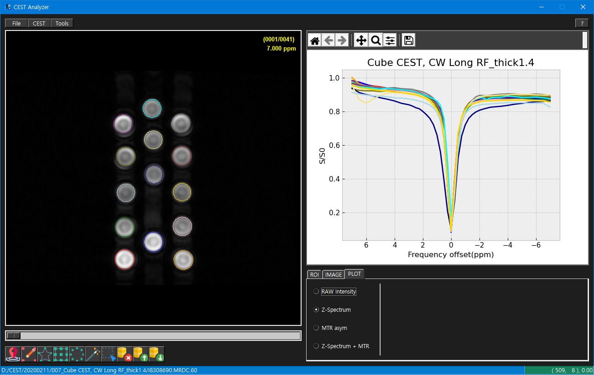
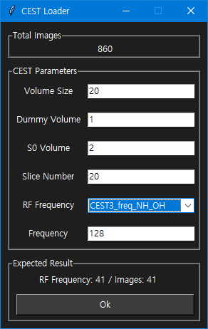
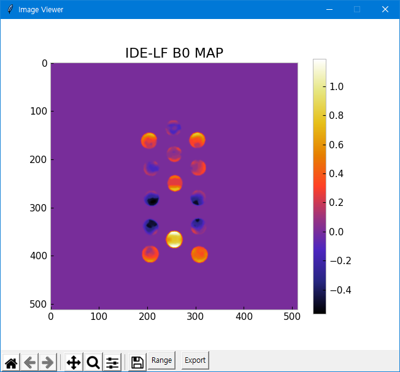

# CEST Analyzer

## Introduction
CEST Analyzer is the software for B0 correction and generating MTR map of CEST (Chemical Exchange Saturation Transfer) images.

## Features
 - Support various B0 correction methods: Spline correction, Lorentzian correction, [IDE-LF](https://www.ncbi.nlm.nih.gov/pmc/articles/PMC6173788/) 
 - CEST mapping: MTR_assymmetry mapping, MTR_Rex mapping, PTR mapping
 - SNR mapping
 - Export processed images as NiFTI file: Z-spectrum, MTR

## Requirements
 - Python3
 - Numpy, Scipy
 - OpenCV, PIL, scikit-image
 - Pydicom, Nibabel
 - matplotlib

## Installation
    $ git clone https://github.com/kim01414/CEST_Analyzer

## How to Use
When you downloaded files and installed all requirements, then running:
    
    $ python main.py

CEST Analyzer must need RF frequency offeset file to handle CEST images. (ex) [./CEST_frequency/CEST3_freq_user8_200716.txt](https://raw.githubusercontent.com/kim01414/CEST_Analyzer/main/CEST_frequency/CEST3_freq_user8_200716.txt)

    128
    96
    64
    48
    32
    16
    0
    -16
    -32
    -48
    -64
    -96
    -128

## Screenshot

## Contacts
techman011@gmail.com

[BMRLab](http://bmr.knu.ac.kr/)
